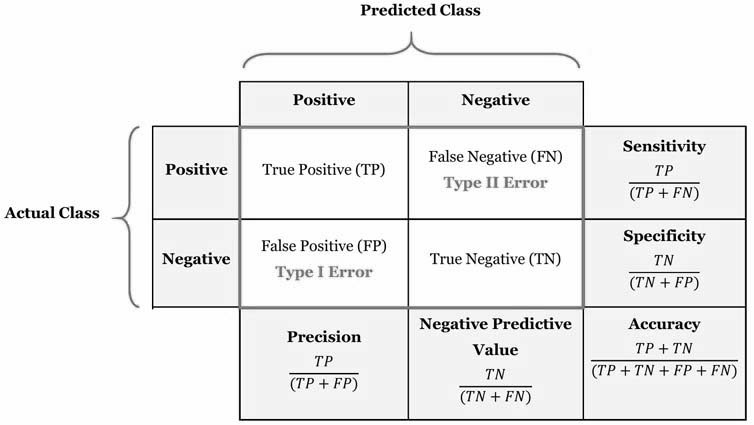
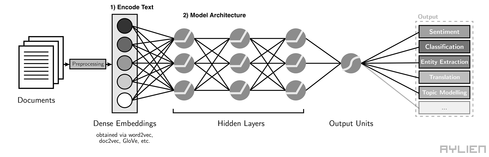
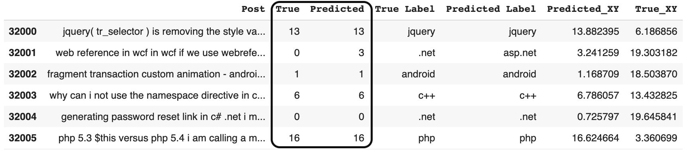
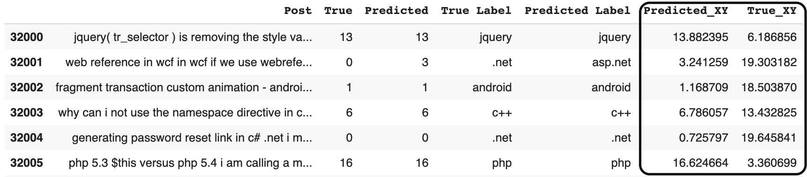
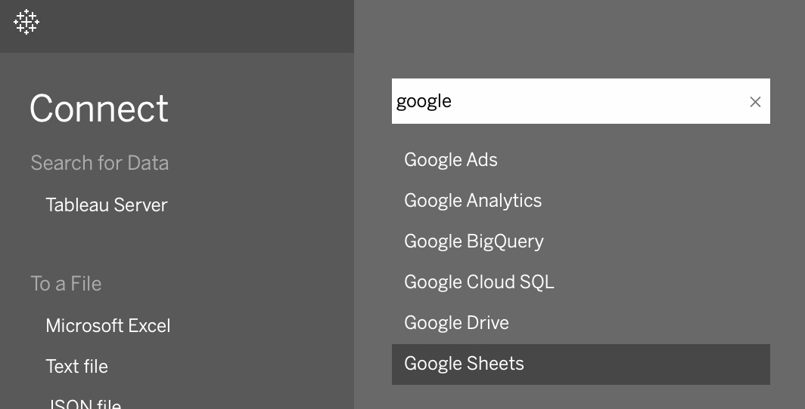

# Interactive Confusion Matrix

#### *A innovative way to visualize text misclassifications within a confusion matrix in Tableau.*

  

## What:

A confusion matrix or error matrix is a tabular visualization to access the performance of a classification model. In the binary case, it allows us to examine the number of false positives and negatives. In the multi-class case, it allows us to examine more generally which classes the model is mixing up. [[Image Source]](https://manisha-sirsat.blogspot.com/2019/04/confusion-matrix.html)

  

## Why:

In classification problems where features are numeric (ex. age, weight, or shoe size) distribution plots can be used to further visualize the feature differences between false positives and true positives. However, in cases where features are a single string of text (ex. blog post, a question, a review), visualizing the cause of misclassification can prove to be challenging. 

In text classification, first you have to decide on how to encode the text based information. Bag of words, Tf-Idf, Word2Vec, or more advanced embeddings ([ELMo & BERT](http://jalammar.github.io/illustrated-bert/)) are commonly used to represent text as numerical features. Once feature engineering is complete, secondly you have to decide on what classification model to test. [[Image Source]](https://towardsdatascience.com/deep-learning-structured-data-8d6a278f3088)

  

Test accuracy and statistics can be used when evaluating combinations of 1) method to encode text numerically and 2) architecture of classification model. However, sometimes simply chasing accuracy isn’t the best choice or even the initial goal. Instead modeling testing can be used to evaluate the strength of the data. Machine learning is not magic as it is only as good as the data we put in. 

When recently working on a semi-supervised text classification project for United Technolgies (UTC), we were using confusion matrices to evaluate models like discussed above. To better understand our data and text misclassifications sometimes the best thing you can do is look at your data. In general, it can also be helpful to look at which tokens are associated with predicting a certain class. Inspecting your data gets at the question could a human manually label this text correctly? While a confusion matrix allows for counting the number of misclassifications, it doesn’t allow for viewing the misclassifications itself. 

  

The new interactive Tableau confusion matrix looks to tackle this issue.

## How:

#### 0) Example Data
I use a straightforward dataset to show the structure of this new confusion matrix. The dataset used are text posts from Google each with an associated code tag (Python, C, Java, HTML). The text classification model was copied from Github user [sararob](https://github.com/tensorflow/workshops/blob/master/extras/keras-bag-of-words/keras-bow-model.ipynb) to generate predicted labels for each of these text posts. To create the new interactive confusion matrix we just need a few more data fields:

#### 1) Assign each label/tag to an integer value. Using a LabelEncoder in Sklearn is an easy way to accomplish this. 

  

#### 2)  Give each text post a random (x,y) coordinate based on its true and predicted label.

  

#### 3)  Write to data frame to CSV file or write to google sheets for more seamless connection to Tableau. 

  

View Colaboratory notebook for more details on creating csv file for Tableau notebook. 

## Interactive Confusion Matrix:

Being able to examine the text which is being misclassified can start to give you a better idea on why the current model might be failing. For example, is the issue semantics or spelling errors or maybe it’s very challenging problem given the available data. NLP problems are difficult but sometimes the best thing you can do to start is visualize your data.   

Below is a general visual framework:
-   Another option is to display only important words not the entire text post.  
-   Filter or size points based on probability a post belongs to a certain class. 
-   *Open to feedback and suggestions.*

  

#### Files:
Link to [[Colaboratory notebook]](https://github.com/longenbach/Tableau-Interactive-Confusion-Matrix/blob/master/notebooks/Classification_Code.ipynb)

Link to [[csv file]](https://github.com/longenbach/Tableau-Interactive-Confusion-Matrix/blob/master/notebooks/Tableau_CSV.csv)

Link to [[Tableau notebook]](https://github.com/longenbach/Tableau-Interactive-Confusion-Matrix/blob/master/notebooks/Confusion_Matrix_copy.twbx)

